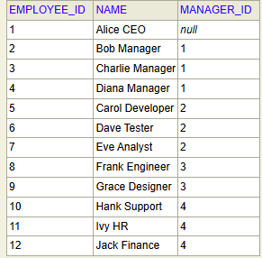
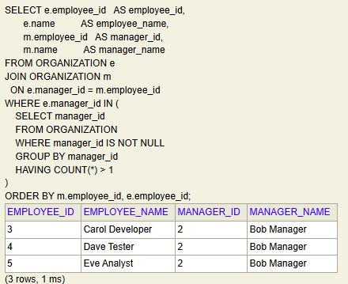

# Spring boot application with Junit and CRUD Example for interview

## Run the command to run the code and test case
```
mvn clean package
```

## Find the employees who share same manager
ORG structure is like below

```
-- Top-level CEO
INSERT INTO ORGANIZATION (employee_id, name, manager_id) VALUES (1, 'Alice CEO', NULL);

-- Managers reporting to Alice
INSERT INTO ORGANIZATION (employee_id, name, manager_id) VALUES (2, 'Bob Manager', 1);
INSERT INTO ORGANIZATION (employee_id, name, manager_id) VALUES (3, 'Charlie Manager', 1);
INSERT INTO ORGANIZATION (employee_id, name, manager_id) VALUES (4, 'Diana Manager', 1);

-- Subordinates under Bob
INSERT INTO ORGANIZATION (employee_id, name, manager_id) VALUES (5, 'Carol Developer', 2);
INSERT INTO ORGANIZATION (employee_id, name, manager_id) VALUES (6, 'Dave Tester', 2);
INSERT INTO ORGANIZATION (employee_id, name, manager_id) VALUES (7, 'Eve Analyst', 2);

-- Subordinates under Charlie
INSERT INTO ORGANIZATION (employee_id, name, manager_id) VALUES (8, 'Frank Engineer', 3);
INSERT INTO ORGANIZATION (employee_id, name, manager_id) VALUES (9, 'Grace Designer', 3);

-- Subordinates under Diana
INSERT INTO ORGANIZATION (employee_id, name, manager_id) VALUES (10, 'Hank Support', 4);
INSERT INTO ORGANIZATION (employee_id, name, manager_id) VALUES (11, 'Ivy HR', 4);
INSERT INTO ORGANIZATION (employee_id, name, manager_id) VALUES (12, 'Jack Finance', 4);


SELECT e.employee_id   AS employee_id,
       e.name          AS employee_name,
       m.employee_id   AS manager_id,
       m.name          AS manager_name
FROM ORGANIZATION e
JOIN ORGANIZATION m
  ON e.manager_id = m.employee_id
WHERE e.manager_id IN (
    SELECT manager_id
    FROM ORGANIZATION
    WHERE manager_id IS NOT NULL
    GROUP BY manager_id
    HAVING COUNT(*) > 1
)
ORDER BY m.employee_id, e.employee_id;

```
## Results for employees who share same manager
